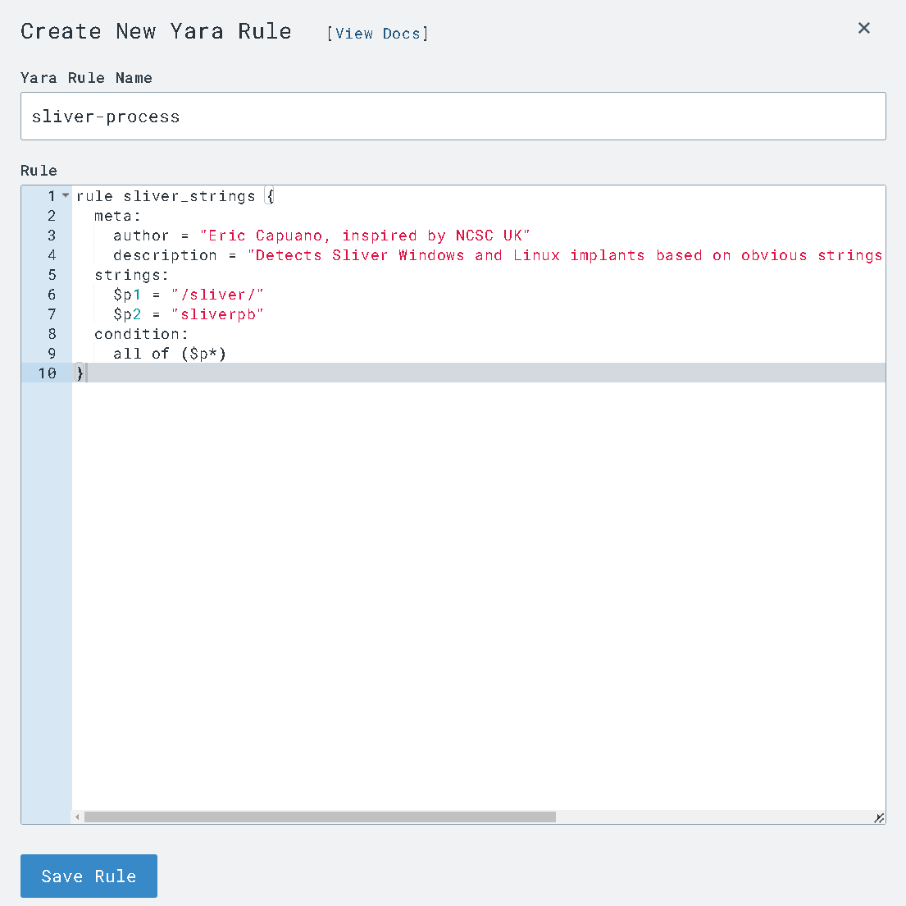
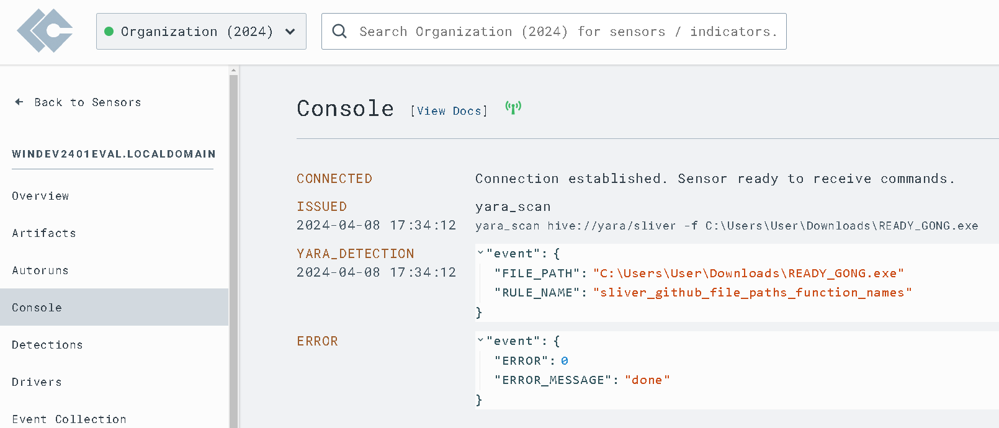

# SOC Analyst Home Lab
### Acknowledgements
The following home lab configuration and accompanying exercises were inspired by Eric Capuano's blog series:
[So you want to be a SOC Analyst?](https://blog.ecapuano.com/p/so-you-want-to-be-a-soc-analyst-intro?sd=pf)

## Objectives
- Deploy and configure lab enviroment with an Ubuntu Server VM (attacker) and a vulnerable Windows 11 VM (Victim) using VMWare Workstation Pro
- Install LimaCharlie EDR agent on our victim endpoint (Windows 11)
- Generate attack telemetry using offensicve tools such as Sliver C2 on Ubuntu Server 
- Observe Windows 11 telemetry in LimaCharlie EDR web interface
- Craft and tune detection & response rules to alert on and respond to malicious activity

## Lab Environment 
- VMWare Workstation Pro
- Ubuntu Server 22.04.1 (Attacker) 14GB Disk size 2 CPU cores 2GB RAM
- Windows 11 Eval (Victim)
## Tools Used
### Offensive Toolset
- Sliver C2
### Defensive Toolset
- LimaCharlie EDR
- Sigma
- Sysmon
- Yara
#### Threat Intelligence
- EchoTrail
- VirusTotal
- Mitre ATT&CK

## Part 1: Generating C2 Telemetry
###### Running Sliver Server on our Ubuntu Vm
  
###### Generating and verifying our Sliver C2 payload on the Ubuntu Vm 
  
###### Starting a HTTP listener using Sliver on the Ubuntu VM
  
###### Running our C2 Payload (READY_GONG.exe) on the victim Windows host
  
###### Starting a Shell using our Sliver C2 payload
  
###### Running commands (info, whoami, etc.) using our C2 Connection
  
###### Running commands (info, whoami, etc.) using our C2 Connection
  
###### Using our shell to view our permissions on our compromised Windows VM
  
###### Using our shell to view privledges on our compromised Windows host
  
###### Using our shell to view network connections on our compromised Windows VM with netstat
  
###### Process Tree on our compromised Windows VM
  
###### Viewing sensitive process access in the LimaCharlie timeline displaying our C2 payload being executed
  
###### Viewing sensitive process access in the LimaCharlie timeline displaying our C2 payload being executed
  
###### Viewing network connections in the LimaCharlie timeline displaying our C2 payload being executed
  
###### Viewing new processes in the LimaCharlie timeline displaying our C2 payload being executed
  
###### Viewing new documents in LimaCharlie showing our C2 Payload
  
###### Viewing our compromised Windows host's Downloads folder displaying our C2 payload
  
###### Viewing suspicious network connections in LimaCharlie
  
###### LimaCharlie displaying our network connection with the attacking Ubuntu VM
  
###### Drilling down on network connections for the suspicious process on our Windows VM
  
###### Viewing running processes on our infected host using LimaCharlie
  
###### Using the VirusTotal intergration on LimaCharlie to search the hash of our C2 Payload
  
###### VirusTotl showing no results for the C2 payload doesn't mean we're in the clear!
  

## Part 2: Crafting Detection Rules
###### Viewing the timeline in LimaCharlie displaying our C2 payload being executed
  
###### Crafing our detection rule for LSASS access
  
###### Testing our detection rule for LSASS access
  
###### Saving our detection rule for LSASS access
  
###### Our LSASS acess detection rule firing in LimaCharlie
  

## Part 3: Crafting Response Rules
###### running "vssadmin delete shadows /all" on our compromised Windows VM (Typical during ransomware infections)
  
###### LimaCharlie timeline showing the deletion of shadow copies command being run
  
###### LimaCharlie shadow copies deletion detection displaying references for a pre-built Sigma rule
  
###### Crafting our own detection and response rule for shadow copy deletion
  
###### Testing our detection and response rule for shadow copy deletion
  
###### Saving our detection and response rule for shadow copy deletion
  
###### LimaCharlie detection rule firing following the deletion of shadow copies on our compromised host
  
###### LimaCharlie detection rule firing following the deletion of shadow copies on our compromised host
  
###### LimaCharlie response rule blocking our actions
  

## Part 4: Tuning False Positives
###### Crafting a detection rule for suspicious svchost execution
  
###### Our detections tab in LimaCharlie flooded with false positives 
  
###### Viewing one of our false positives generated by our suspicious svchost execution detection rule
  
###### Viewing our svchost detection rule in preparation for tuning the false positive
  
###### Tuning our suspicious svchost detection rule
  
###### Testing our tuned detection rule with success!
  

## Part 5: Yara Scanning
###### Crafting our Sliver YARA rule (courtesy of NSSC UK)
  
###### Crafting our YARA detection rule so we can be alerted of our of YARA findings
  
###### Crafting our Sliver-Process YARA rule (courtesy of NSSC UK & Eric Capuano)
  
###### Crafting our YARA detection in memory rule so we can be alerted of our of YARA findings
  
###### Testing our YARA rule
  
###### Confirmation that our YARA rule picked up our Sliver payload 
  
###### Automating our YARA scan for processes launched from our Downloads folder
  
###### Automating our YARA scan for executables that are downloaded to our Downloads folder
  
###### Our YARA detection firing after the executable is dropped in our Downloads folder
  
###### Our YARA detection firing after the executable is launched from our Downloads folder
  

